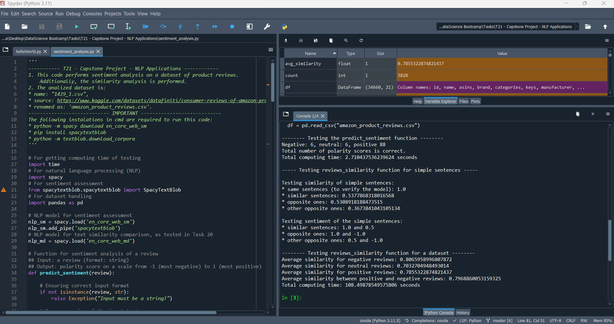
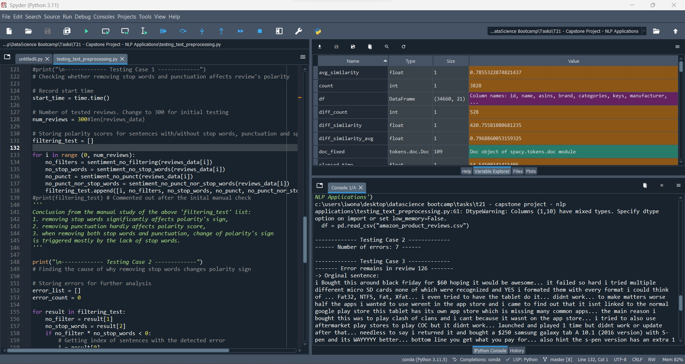
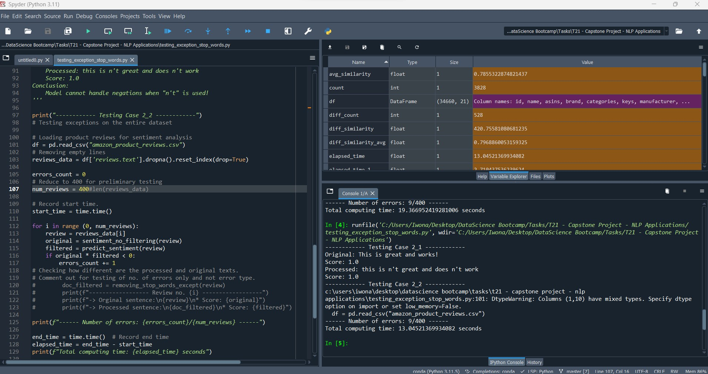

# Project name: Sentiment Analysis on Product Reviews

## Project description

This project involves developing a Python program for sentiment analysis on a dataset of product reviews. The program, named sentiment_analysis.py, utilizes the spaCy library for natural language processing tasks to analyze and classify the sentiment of the reviews.
Additional codes - testing_exception_stop_words.py and testing_exception_stop_words.py - test the validity of the used sentiment method from SpacyTextBlob.

## Table of Contents
1. [Installation](#installation)
2. [Usage](#usage)
3. [Credits](#credits)

## Installation

To install and run this project locally, follow these steps:

1. **Clone the repository:**
   ```
   git clone https://github.com/jsymonowicz/finalCapstone.git
   ```

2. **Install dependencies:**
   - Download the spaCy English model:
     ```
     python -m spacy download en_core_web_sm
     ```
   - Install the spacytextblob package:
     ```
     pip install spacytextblob
     ```
   - Download TextBlob corpora:
     ```
     python -m textblob.download_corpora
     ```

3. **Download the dataset:**
   Download the Consumer Reviews of Amazon Products dataset named `amazon_product_reviews.csv` (Source: https://www.kaggle.com/datasets/datafiniti/consumer-reviews-of-amazon-products, "1429_1.csv")

## Usage

Read instructions and comments in 'sentiment_analysis_report.pdf'.
Execute codes in the Python IDE of your choosing (e.g. Spyder). The order does not matter.

- **sentiment_analysis.py**: conducts sentiment analysis on a dataset of product reviews and also performs similarity analysis.
  

  
- **testing_text_preprocessing.py**: evaluates the impact of removing stop words, punctuation, and spaces on the polarity score of a review. The goal is to determine the most suitable text preprocessing methods for preserving the true sentiment.
  


- **testing_exception_stop_words.py**: script dedicated to testing which stop words should not be removed from the `predict_sentiment` function to maintain the accuracy of sentiment analysis.
  

## Credits

This project was developed by Joanna Symonowicz as part of HyperionDev Data Science BootCamp.

If you find this project useful, consider giving it a star on GitHub and citing the authors. Contributions and feedback are welcome!
